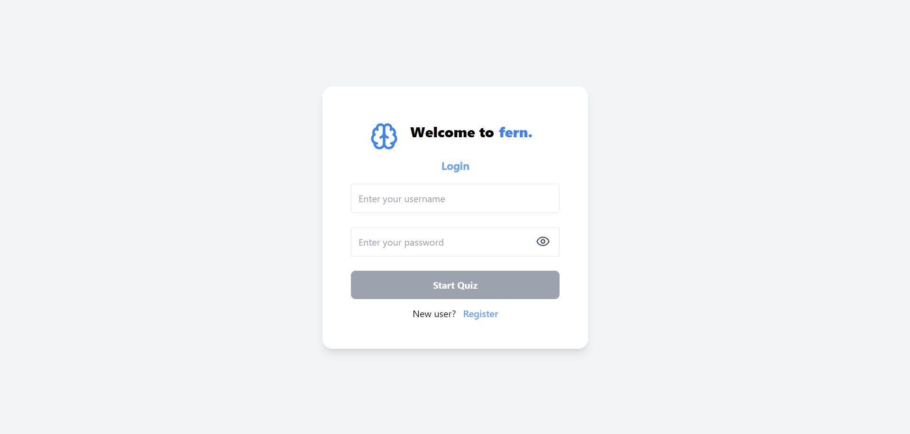
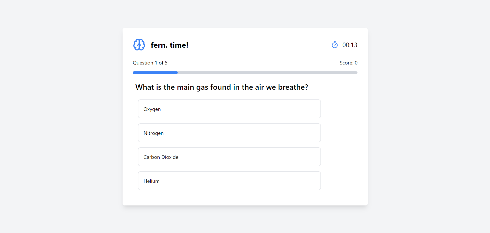
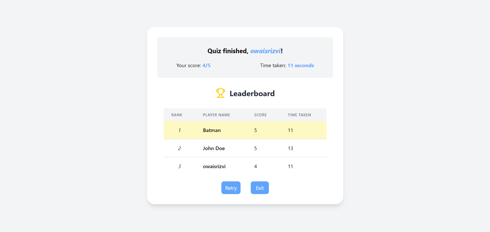

# fern.
fern. is a simple quiz application.

## Deployed here

    https://fern-teal.vercel.app/

## Installation
1. Clone the repository:
    ```bash
    git clone https://github.com/owais-rizvi/fern..git
    cd fern.

2. Install dependencies of backend and start the server:
    ```bash
    cd backend
    npm install
    npm start
    
3. Install dependencies of frontend and start the server:
    ```bash
    cd..
    cd frontend
    npm install
    npm start

## Images



